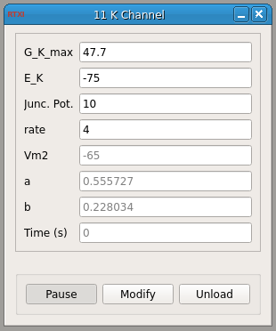

###Potassium Ion Channel

**Requirements:** None  
**Limitations:** None  

  

<!--start-->

This module presents an example of a potassium ion channel where I = G\_K\_max\*a^3\*b\*(Vm-E\_K)  

<!--end-->

####Input Channels
1. input(0) - Vm : membrane voltage  (V)

####Output Channels
1. output(0) - Iout : injected current (A)

####Parameters
1. G_K_max - mS/cm^2
2. E_K - mV
3. Junc. Pot. - junction potential (mV)
4. rate - number of integrations per time step

####States
1. Vm2 - membranve potential (mV), same as input
2. a - a-type potassium activation
3. b - a-typle potassium inactivation
4. Time (s) - Time (s)
